<!--
author:   Sebastian Zug; André Dietrich; Oliver Löwe

email:    sebastian.zug@informatik.tu-freiberg.de

version:  0.3.0

language: de

narrator: UK English Female

icon:     TUBAF_Logo_schwarz.png

link:     style.css

import:   https://raw.githubusercontent.com/LiaTemplates/LiveEdit-Embeddings/refs/tags/0.0.1/README.md
          https://raw.githubusercontent.com/liascript-templates/plantUML/master/README.md
          https://raw.githubusercontent.com/liaScript/mermaid_template/master/README.md

                         

red:  @mark(#FF888888,@0)

-->

# OER – Connected Lecturers

<h2>Projektziele und Status der Umsetzung</h2>

---

| Partner an der TUBAF                      | Projektbeteiligte             |
| ----------------------------------------- | ----------------------------- |
| Lehrstuhl Softwaretechnologie und Robotik | André Dietrich, Sebastian Zug |
| Universitätsbibliothek                    | Oliver Löwe                   |


<h5><p>Oliver Löwe, Workshop DINI AG KIM 21.04.2026</p></h5>

---

> Die Vorhaben werden mitfinanziert durch Steuermittel auf der Grundlage des vom Sächsischen Landtag beschlossenen Haushaltes. Die organisatorische Gesamtkoordination der Vorhaben obliegt der Geschäftsstelle des [AK Elearning Sachsen](https://bildungsportal.sachsen.de/portal/parentpage/institutionen/arbeitskreis-e-learning-der-lrk-sachsen/). 

<!-- class="reference"-->
> Dieser Vortrag ist eine Open Educational Resource (OER) und steht unter der Lizenz [CC BY 4.0](https://creativecommons.org/licenses/by/4.0/deed.de). Alle enthaltenen Inhalte können frei verwendet werden und sind unter https://github.com/TUBAF-IFI-ConnectedLecturer/Presentations/blob/main/Wel2025/Presentation.md verfügbar

## Kurzvorstellung der Projektpartner

             {{0-2}}
***********************************

__Arbeitsgruppe Softwaretechnologie und Robotik__

***********************************

             {{0-1}}
***********************************

+ _Forschungsfeld 1: Robotik_

   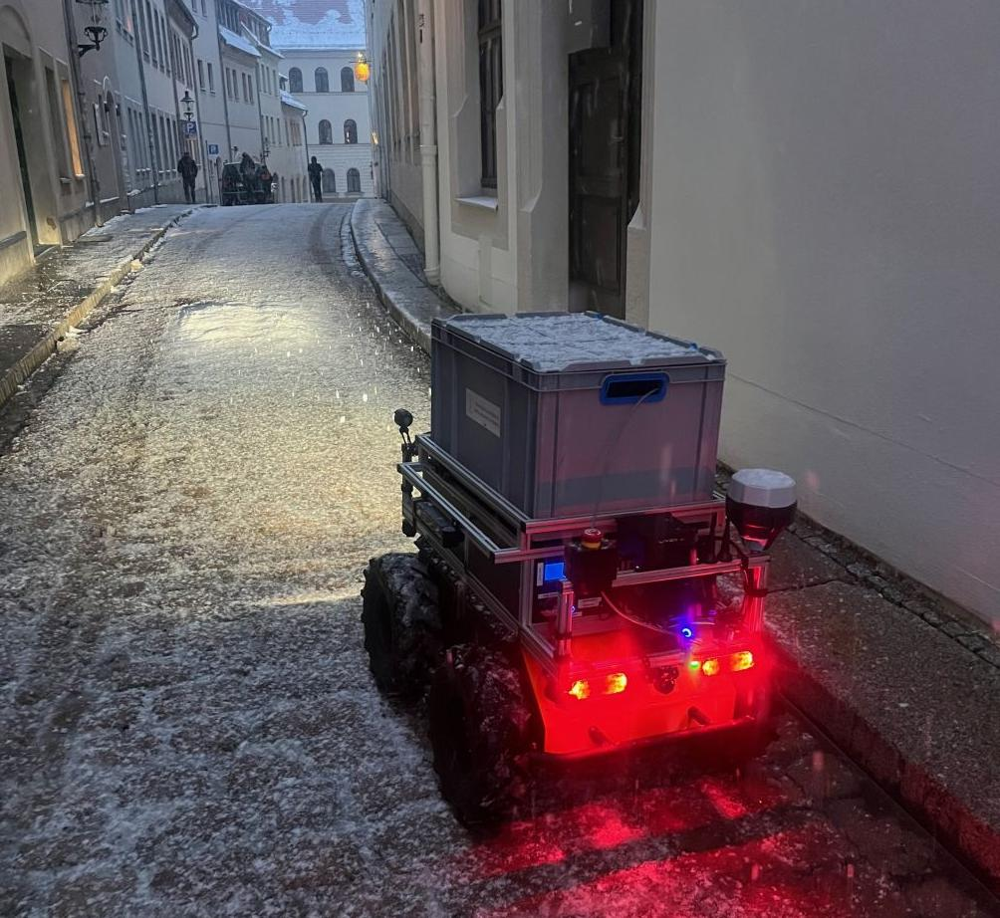
   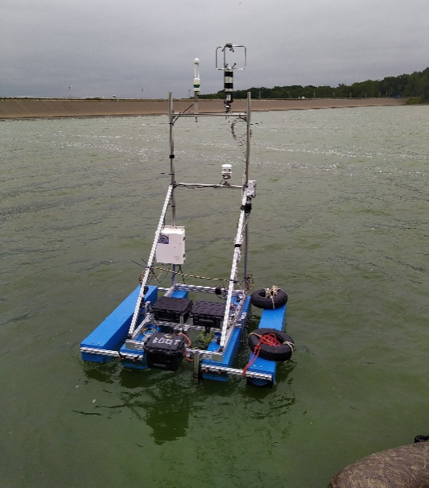

***********************************

             {{1-2}}
***********************************

+ _Forschungsfeld 2: Digitale Lehre_

    Die Arbeitsgruppe entwickelt LiaScript und Edrys als Open Source Lernplattformen für die digitale Lehre.

```markdown @embed.style(height: 550px; min-width: 100%; border: 1px black solid)
# Vom Text zur Darstellung

__Mathematik__

$f(x) = x^2$

__Tabellen__

| X | B(y) | C(y) |
|---|:----:|:----:|
| 1 |   2  |   3  |
| 4 |   5  |   6  |

__Sprache__

> Click to run!
>
> {{|> Deutsch Female}}
> Markdown ist eine vereinfachte Auszeichnungssprache, die der Ausgangspunkt unserer Entwicklung von LiaScript war.
```


***********************************

             {{2-3}}
***********************************

__Universitätsbibliothek der Bergakademie Freiberg__

- Lehr- und forschungsunterstützende, informationswissenschaftliche Einrichtung an der TUBAF
- Transformation taditioneller bibliothekarischer Aufgaben und Distributionswege hin zu digitalen Angeboten und Prozessen
- Übernahme von Smart Library Konzepten - Schaffung von Lehr- und Lernräumen (Podcaststudio, AR/VR-Räume)
- Intensive Kooperation mit den Wissenschaftlerinnen vor Ort z.B. Institut für Informatik
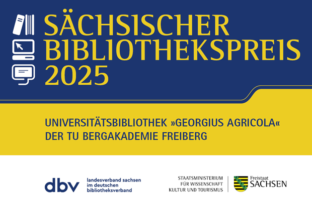

***********************************

## Warum Materialien teilen?

<!--
style="width: 100%; max-width: 860px; display: block; margin-left: auto; margin-right: auto;"
-->
```ascii

      Wunsch nach                                              Wunsch nach
  einfacher Umsetzung  -----------> Konflikt <----------- spezifischen Elementen
                                       |                       im Material
                                       |
                                       v
                              OER als Lösungsansatz

```

       {{1-2}}
> _Open Educational Resources (OER) sind Bildungsmaterialien jeglicher Art und in jedem Medium, die unter einer offenen Lizenz stehen. Eine solche Lizenz ermöglicht den kostenlosen Zugang sowie die kostenlose Nutzung, Bearbeitung und Weiterverbreitung durch Dritte ohne oder mit geringfügigen Einschränkungen._ (Quelle: [UNESCO](https://www.unesco.de/bildung/open-educational-resources))


### Auffindbarkeit als eine Hürde von OER

Welche Hemnisse sehen Lehrende bei der Verwendung von OER-Inhalten in Ihrer Lehre?

1. _Rechtliche Unsicherheiten_
2. _Technische Hürden_
3. _Fehlende Passgenauigkeit_
4. _Eigene Qualitätsstandards_
5. ___Aufwändige Suche nach passenden Materialien___
6. ...

<!-- class="reference"-->
> "_Vorstudie zur OER-Initiative sächsischer Hochschulen_" (2023-2024) [Link](https://www.hd-sachsen.de/projekte/oer-initiative-02/2023-07/2024)

<!-- class="reference"-->
> "_Offene Bildungsinfrastrukturen - Anforderungen an eine OER-förderliche IT-Infrastruktur_" (2023), HIS-Institut für Hochschulentwicklung e. V, [Link](https://medien.his-he.de/publikationen/detail/offene-bildungsinfrastrukturen)

<!-- class="reference"-->
> "_Didaktische Metadaten in OER- und Lehrportalen Von der Prämisse pädagogischer Neutralität zur Stärkung einer offenen Lehrpraxis_" (2024), HIS-Institut für Hochschulentwicklung e. V, [Link](https://medien.his-he.de/fileadmin/user_upload/Publikationen/Forum_Hochschulentwicklung/HIS-HE-Forum_Didaktische_Metadaten_in_OER-_und_Lehrportalen.pdf)

### Besondere Motivation mit Blick auf OPAL

<!-- class="reference"-->
> "_Anreicherung digitaler Objekte mit Metadaten in OPAL – Implementierung einer Schnittstelle zur Anbindung externer Recherchesysteme_", 2017/2018, [Link](https://bildungsportal.sachsen.de/impulse/projekt/anreicherung-digitaler-objekte-mit-metadaten-in-opal-implementierung-einer-schnittstelle-zur-anbindung-externer-recherchesysteme/)
             {{0-1}}
Das Projekt der UB zielte 2018 darauf ab, die im LMS OPAL gekapselten, freien (sic!) Inhalte von außen verfügbar zu machen und prototypisch im Suchmaschinenindex von finc einzubinden, damit sie über die sächsischen Bibliothekskataloge nachweisbar und genutzt werden können.

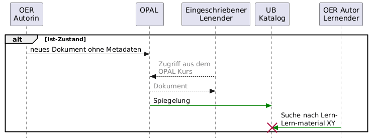

             {{1-2}}
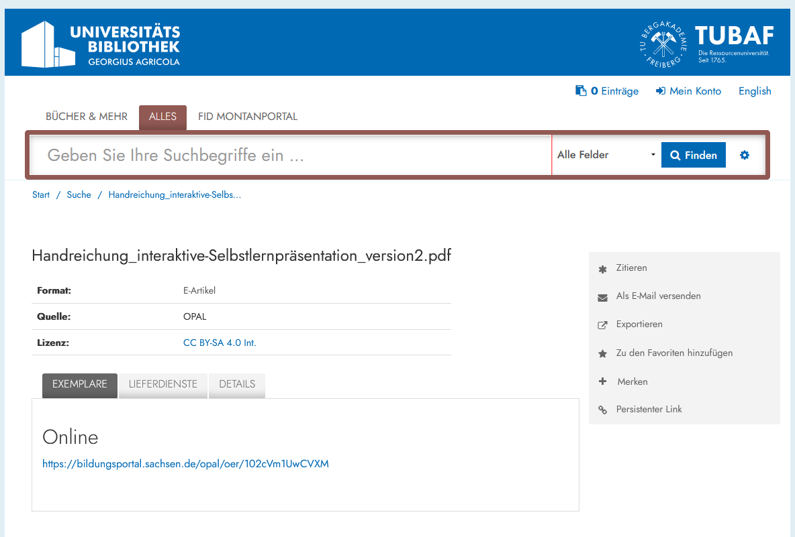

> Es fehlen größtenteils die Metadaten für die gezielte Exploration der OER-Inhalte

> Kompletter Bestand der Quelle: [Link](https://katalog.ub.tu-freiberg.de/Search/Results?page=13&hiddenFilters%5B%5D=institution%3A%22DE-105%22&lookfor=source_id%3A172&type=AllFields)


### Ursachenforschung

{{0-1}}

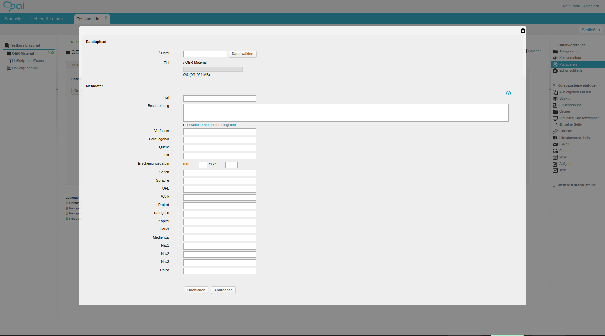

---


   
{{1-2}}

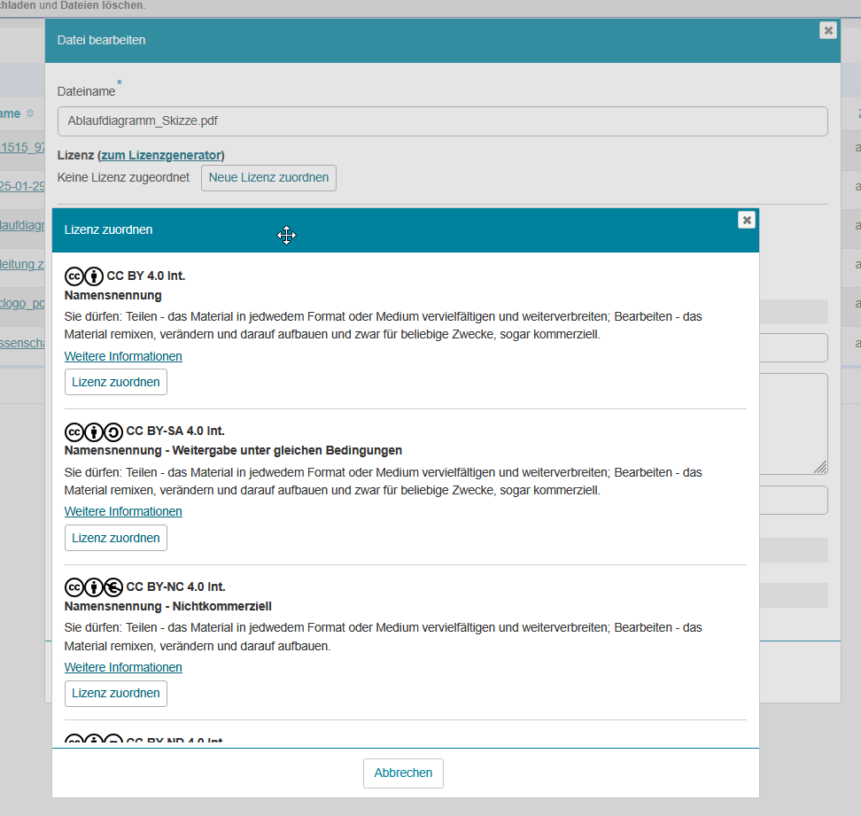

## Projektziele

```ascii
+-----------------------------------------------+
|    Extraktion von Metadaten                   |        
|    Evaluation mit Autoren                     |        
|  + Vorschlagssystem                           |
| ---------------------------                   |
|  = Connected Lecturers                        |    
+-----------------------------------------------+                                      .
```

---


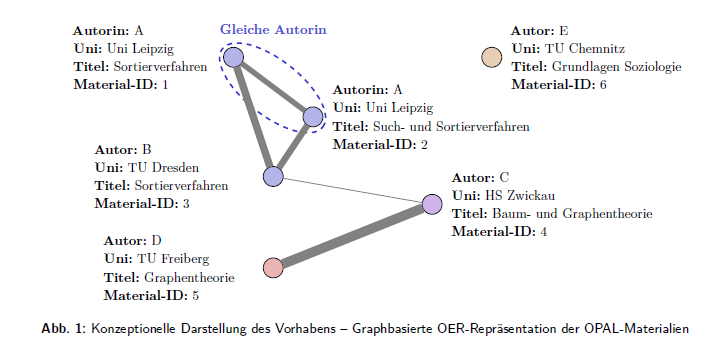


> In diesem Projekt fokussieren wir uns auf textuelle Einzeldateien, die in OPAL hochgeladen werden. Ganze Kurse sowie andere Dateiformate bleiben außen vor.

### Schritt 1: Aggregation der Daten

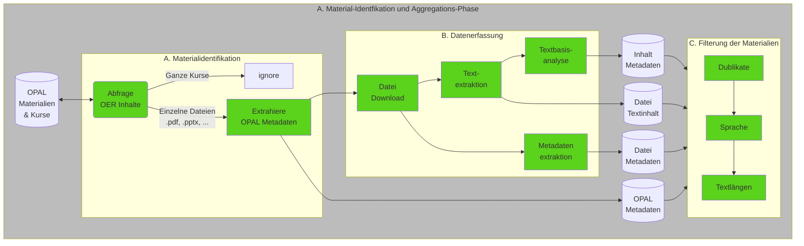

> Insgesamt reden wir über mehr als 15.000 Dateien. 55% davon gehören zu den Office Datei-Typen (`.pptx`, `.docx`, ...), `.md` und `.pdf` Dateien (Stand August 2025).
> Die Inhalte unterscheiden sich stark und reichen von gescannten handschriftlichen Notizen bis zu ganze Lehrbüchern.

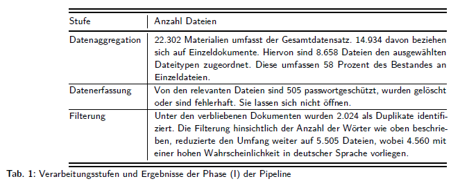

> Die Inhalte wurden mithilfe des langchain-Frameworks aus autogenerierten oder manuell eingetragenen Metadaten extrahiert (keine KI)


### Schritt 2: Extraktion der Metadaten


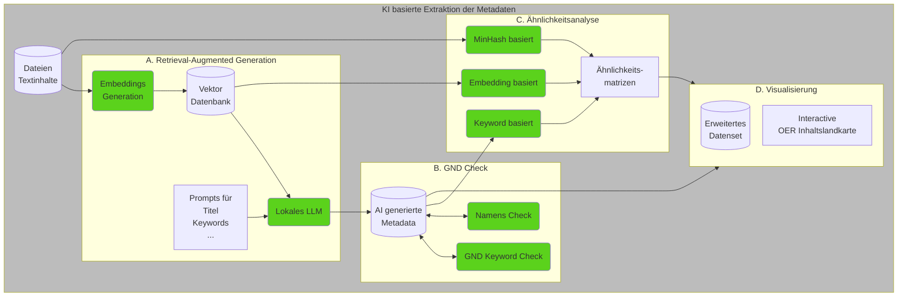

Die Umsetzung der gesamten Pipeline ist als Open Source verfügbar: [Data_aggregation](https://github.com/TUBAF-IFI-ConnectedLecturer/Data_aggregation). Die gesamte Pipeline ist in Python implementiert und nutzt für die AI Komponenten eine Nvidia DGX2. Als LLM kommt aktuell ein [llama3](https://ollama.com/library/gemma3) zum Einsatz.

> Die Durchführung der KI-basierten Metadatenerhebung nahm auf einer DGX2 etwa 62 Stunden in Anspruch. Die NVIDIA DGX-2 aus dem Jahr 2020 fasst 16 GPUs (NVIDIA Tesla V100 32GB) mit bis zu zwei Petaflops an AI-Rechenleistung zusammen. Dabei lief das Llama3-Modell auf bis zu acht der V100 Grafikkarten. Im Laufe der Entwicklung wurde mit weiteren Modellen (Llama3.1, Gemma2, Gemma3, Mistral) experimentiert, insbesondere die Schlagwortgenerierung zeigte mit dem Llama3-Modell die besten Ergebnisse.

## Ergebnisse

> Beispieldatensatz von Oliver Löwe aus Freiberg ...

<!-- data-type="none" -->
| Label             | Wert                                                                                                                                                                                                                                                                                                                                                                                                          |
| --------------------- | ------------------------------------------------------------------------------------------------------------------------------------------------------------------------------------------------------------------------------------------------------------------------------------------------------------------------------------------------------------------------------------------------------------- |
| `opal:filename`         | cdvost_praesi.pptx |
| `opal:oer_permalink`    | https://bildungsportal.sachsen.de/opal/oer/1PGOlNUd1m7g |
| `opal:license`          | CC BY-NC 4.0 Int. |
| `opal:author`           | Oliver Löwe |
| `opal:title`            | Anlagen bergbaulicher Zeichnungen beim Kultur-Hackathon Coding Da Vinci |
| `opal:comment`          | Coding Da Vinci Ost von der Universitätsbibliothek Leipzig ausgetragen; 14./15.4.2018; UB Freiberg ist Datengeber der Leupoldsammlungen |
| `opal:language`         | Deutsch |
| `opal:publicationMonth` | 4 |
| `opal:publicationYear`  | 2018 |
| `opal:revisedAuthor`    | [Name(Vorname='Oliver', Familienname='Löwe', Titel='')] |
| `pipe:ID`               | 1PGOlNUd1m7g |
| `pipe:file_type`      | pptx |
| `file:author`           | Löwe Oliver |
| `file:keywords`         | |
| `file:subject`          | |
| `file:title`            | Zeichnungen bergbaulicher Anlagen (Leupoldsammlung) |
| `file:created`          | 2018-04-04 10:39:43+00:00 |
| `file:modified`         | 2018-04-14 11:24:44+00:00 |
| `file:language`         | |
| `file:revisedAuthor`    | [Name(Vorname='Oliver', Familienname='Löwe', Titel='')] |
| `ai:author`             | Oliver Löwe |
| `ai:revisedAuthor`      | [Name(Vorname='Oliver', Familienname='Löwe', Titel='')] |
| `ai:affilation`         | TU Bergakademie Freiberg |
| `ai:title`              | Zeichnungen bergbaulicher Anlagen (Leupoldsammlung) |
| `ai:type`               | Präsentation |
| `ai:keywords_ext`       | Montanwesen, Erzgebirge, Bergbaumuseum, Grubenlampen, Gezähe, bergmännische Uniformen, kunsthistorische Gegenstände, montanhistorischem Bezug, Autographen, Zeichnungen, Risse, Montanwissenschaft, TU Bergakademie Freiberg, Leupoldsammlung, Schwungradhaspel, Bartholomäus Schacht |
| `ai:keywords_gen`       | Montanwesen, Bergbau, Erzgebirge, Montanhistorie, Geognosie, Mineralogie, Lagerstättenlehre, Zeichnungen, bergbauliche Anlagen, Leupoldsammlung, TU Bergakademie Freiberg, Universitätsbibliothek, Deutsche Digitale Bibliothek, Europeana, MetsMods, OA1-PMH |
| `ai:keywords_dnb`       | Bergbau, Montanhistorie, Erzgebirge, Bergakademie, Geognosie, Mineralogie, Lagerstättenlehre, Technisches Zeichnen, Konstruktionszeichnen, Hochschulsammlungen |
| `ai:dewey`              | [{'notation': '930', 'label': 'Geschichte des Altertums bis ca. 499, Archäologie', 'score': 0.5}, {'notation': '940', 'label': 'Geschichte Europas', 'score': 0.3}, {'notation': '900', 'label': 'Geschichte und Geografie', 'score': 0.2}] |
| `ai:affiliation`        | TU Bergakademie Freiberg |
| `ai:summary`            | Die Leupoldsammlung umfasst historische Zeichnungen und Risse von bergbaulichen Anlagen, die für die montanhistorische Forschung von großer Bedeutung sind. Die Sammlung enthält Unikate und ermöglichte den originalgetreuen Nachbau eines Schwungradhaspels. Durch die digitale Bereitstellung dieser Sammlung können Nutzer Einblick in die Geschichte des Bergbaus und der Montanwissenschaften gewinnen. |

> Die DDC Klassifikation 622 trägt das Label "Bergbau und verwandte Tätigkeiten" vgl. [GND](https://lobid.org/gnd/4005614-4)


### Schlagwörter

Übereinstimmung der Keywords mit der GND über die lobid-API

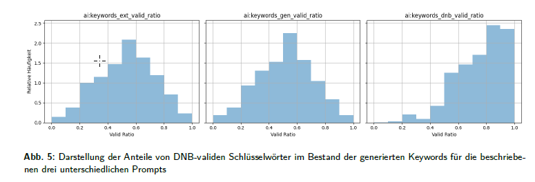

15 Schlagwörter, die (i) im Dokument enthalten sind, (ii) aus den Inhalten des Dokumentes generiert wurden, (iii) aus den Inhalten generiert wurden und mit der Normdatei übereinstimmen.

> Die gezielte Anweisung, bibliothekskonformes Vokabular zu verwenden, erhöht die Qualität der Metadaten. Ein Befund, der für die Praxis der Prompt-Gestaltung bei der Sacherschließung relevant ist.


### Namen von Autor:innen

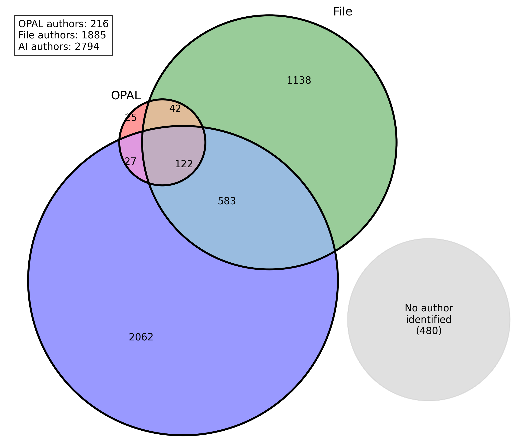

### DDC-Klassifikation

> Dewey-Klassen von 000 bis 999 wurden mit einer Liste an Bezeichnern bei der Anfrage übergeben. Von den ursprünglich 13.486 Dewey-Zuordnungen für 4.548 Dokumente waren lediglich fünf Einträge enthalten, die keine Klassifikation zuließen. Die anschließende Analyse zeigte 202 verschiedene DDC-Notationen mit durchschnittlich drei Klassifikationen pro Dokument.

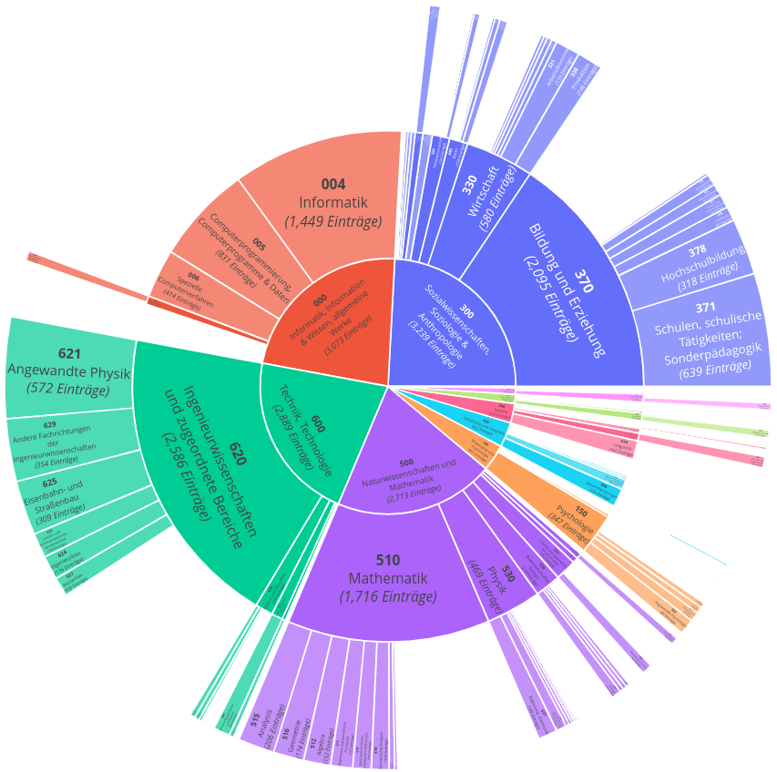


> Die Differenzierung ist in weiten Teilen zu gering, als dass auf dieser Basis eine sinnvolle Recherche möglich ist. So werden alle Informatik-Dokumente in der Hauptklasse 004 zusammengefasst, die Unterklassen 004.1 (Programmierung), 004.2 (Datenbanken) usw. werden  nicht berücksichtigt.


### Darstellung der Ergebnisse 

       {{0-1}}
********************************

**Ergebnis als Tabelle aus ** https://raw.githubusercontent.com/TUBAF-IFI-ConnectedLecturer/Presentations/refs/heads/main/Wel2025/data/nodes.html

********************************

        {{1-2}}
********************************

**Ergebnis in Suchmaschine:** (tbc.)

vorher:    


nachher:    
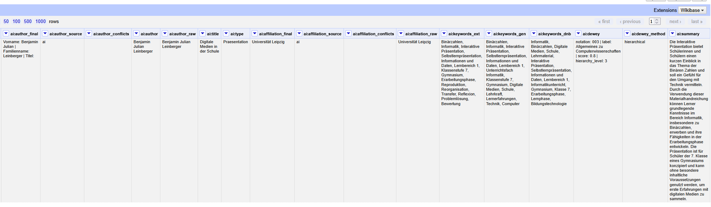

********************************

        {{2-3}}
********************************

**Ergebnis als Graph:** https://tubaf-ifi-connectedlecturer.github.io/Data 

<iframe src="https://tubaf-ifi-connectedlecturer.github.io/Data/?mode=normal&search=freiberg&id=102cVm1UwCVXM" style="width:100%; height:80vh; border:1px solid #ccc;" title="OER Inhaltslandkarte"></iframe>

********************************

### Ähnlichkeitsanalyse

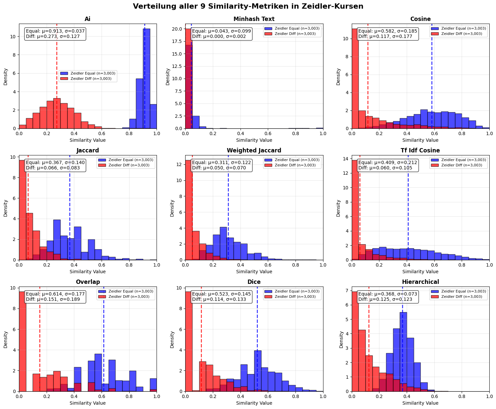


## Zusammenfassung

* Überlegenheit der Embedding-basierten Metrik zur Ähnlichkeitsermittlung
* RAG-basierte Extraktion liefert für den überwiegenden Teil der Materialien verwertbare Ergebnisse
* Die Dewey-Klassifikation erreicht zwar eine hohe Abdeckung, bleibt aber auf der Ebene der Hauptklassen (z. B. 004 für Informatik) stehen, ohne in Unterklassen zu differenzieren.

* Andere Formate und Sprachen werden aktuell nicht berücksichtigt


### Produktivschaltung OPAL

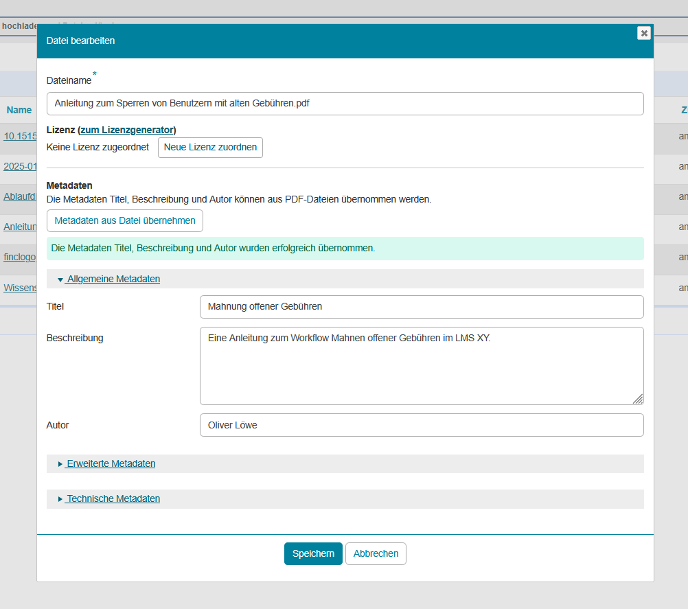


<div class="left">

> Vielen Dank für Ihr Interesse! Wir freuen uns auf Ihre Fragen und Anregungen.

Sebastian Zug

<a href="mailto:sebastian.zug@informatik.tu-freiberg.de">
    sebastian.zug@informatik.tu-freiberg.de 
</a>

------------------

Oliver Löwe

<a href="mailto:oliver.loewe@ub.tu-freiberg.de">
    oliver.loewe@ub.tu-freiberg.de
</a>

</div>

<div class="right">


</div>
